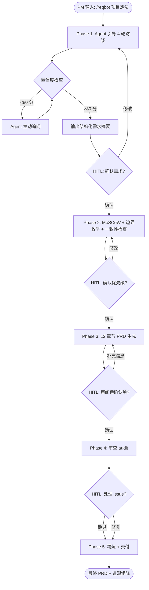

# PRD — ReqBot: AI 需求分析 Agent

---

## 一、文档概述

| 字段 | 内容 |
|------|------|
| 项目名称 | ReqBot — AI 需求分析 Agent |
| 文档版本 | v1.0 |
| 作者 | 待填写（面试者） |
| 创建日期 | 2026-05-12 |
| 最后更新 | 2026-05-12 |
| 状态 | 草稿 |
| 涉及干系人 | 产品经理（使用方）、面试官（评审方） |

---

## 二、产品目标与背景

### 2.1 背景

产品经理 60% 以上的时间花在需求收集、文档撰写和多方对齐上。现有方案要么是通用 LLM（ChatGPT 单次对话生成 PRD），要么是传统文档工具（Notion/Confluence 模板）。两者的共同问题是：

- 缺乏结构化访谈引导，依赖 PM 自己的提问能力
- 无来源追溯，PRD 中的需求无法回溯到干系人原始输入
- 无系统化边界用例枚举，依靠 PM 个人经验
- 无自审查机制，遗漏和不一致靠人工复审发现

[来源：分析推断—PM 日常 workflow 观察]

### 2.2 产品目标

- 将需求分析全流程（访谈→PRD）的产出标准化，减少信息遗漏
- 使每条功能需求可追溯到干系人原始输入，提升需求变更时的决策质量
- 通过系统化边界用例枚举，在 PRD 阶段暴露潜在缺陷，降低开发返工

### 2.3 产品愿景（一句话）

让每个 PM 拥有一个专业的需求分析搭档，从访谈到 PRD 交付，系统化而非凭经验。

---

## 三、目标用户与场景

### 3.1 用户画像

| 画像名称 | 角色描述 | 核心诉求 | 使用频率 | 来源 |
|----------|---------|---------|---------|------|
| 独立 PM | 负责 0-1 产品，无专职 BA 支持 | 快速产出高质量 PRD，减少遗漏 | 每个项目 1-2 次 | [来源：分析推断—中小团队 PM 典型工作模式] |
| 初级 PM | 1-3 年经验，需求分析经验不足 | 获得结构化引导，学习系统分析方法 | 每周 | [来源：分析推断—PM 成长路径] |
| 面试者 | 应聘 AI Agent PM 岗位 | 展示 Agent 架构设计和产品思维 | 面试前准备 + 现场 Demo | [来源：直接需求] |

### 3.2 核心使用场景

- 作为独立 PM，我想要用 ReqBot 引导我完成一场自我访谈，以便系统化梳理新项目的需求
- 作为面试者，我想要现场运行 `/reqbot` 演示 Agent 工作流，以便向面试官展示我的产品设计能力
- 作为面试者，我想要一份 ReqBot 自身的 PRD 和架构文档，以便面试中展示文档标准化能力

[来源：分析推断—基于岗位 JD 要求]

---

## 四、功能需求

### 4.1 功能列表（MoSCoW 优先级）

| ID | 功能名称 | 优先级 | 描述 | 验收标准 | 来源 |
|----|---------|--------|------|---------|------|
| FR-001 | 结构化访谈 | Must | Agent 引导 4 轮访谈：背景收集→深入追问→缺口检测→模糊澄清 | 完成 4 轮后可输出 ≥10 条结构化需求 | [来源：分析推断—PRD 模板对输入完整性的要求] |
| FR-002 | 置信度评分与主动追问 | Must | 对每条需求评估置信度，<80 分主动追问 | 所有输出需求的平均置信度 ≥ 75 | [来源：分析推断—避免幻觉需求] |
| FR-003 | 需求分类与优先级 | Must | MoSCoW 分类 + 每项附理由 | 所有需求有分类且理由可追溯到访谈摘录 | [来源：分析推断—标准 PM 实践] |
| FR-004 | 边界用例枚举 | Must | 按 5 类系统化枚举，每类 ≥1 条 | 最终 PRD 第 9 节覆盖全部 5 类 | [来源：knowledge/edge-case-taxonomy.md] |
| FR-005 | PRD 生成 | Must | 按 12 章节模板填充，注入需求 ID 锚点 | 12 章节全部出现，每节必填字段非空或标记「待确认」 | [来源：knowledge/prd-template.md] |
| FR-006 | 需求追溯矩阵 | Must | 构建 4 向追溯：访谈原文→需求→PRD章节→验收标准 | 每条 FR 至少 1 条来源链接 | [来源：架构设计要求] |
| FR-007 | 人在回路闸口 | Must | 每阶段切换需用户确认 | 4 个闸口全部触发确认提示 | [来源：HITL 设计模式] |
| FR-008 | 自审查 | Must | 完整度 + 模糊表述 + 可度量性 + 追溯性检查 | 审查报告至少发现 1 个可改进项 | [来源：质量保证需求] |
| FR-009 | 多项目并行 | Should | 区分不同项目的产物 | 不同 project-slug 写入独立文件 | [来源：实际使用推断] |
| FR-010 | 中断恢复 | Should | 会话中断后可从产物目录恢复状态 | 重新加载后可从最近完成的阶段继续 | [来源：Claude Code 会话限制] |
| FR-011 | 行业模板选择 | Could | 根据项目类型推荐不同 PRD 模板 | 待确认-需积累使用数据后定义匹配规则 | [来源：扩展性设计] |
| FR-012 | 多干系人协作 | Won't (V1) | 多个干系人分别访谈后合并需求 | — | [来源：V1 聚焦单人使用场景] |

### 4.2 FR-001 功能详解：结构化访谈

- **前置条件**：用户触发 `/reqbot` 并提供项目简要描述
- **主流程**：
  1. Orchestrator 加载 interviewer Agent 定义
  2. Round 1：收集问题背景、目标用户、成功指标、约束条件、现有方案
  3. Round 2：对模糊点深入追问，量化定性描述
  4. Round 3：检测缺失信息（角色、流程、集成、异常）
  5. Round 4：对模糊表述列出 2-3 种解读，让用户选择
  6. 输出结构化 JSON，包含置信度
- **异常流程**：用户若提前终止访谈 → 保存当前产物，标记阶段为 "partial"
- **来源**：[来源：agents/interviewer.md 定义的 4-round 流程]

---

## 五、范围定义

### 5.1 V1 范围

- 5 阶段工作流完整闭环
- 支持单人 PM 自我访谈模式（PM 同时是输入者和决策者）
- 标准 12 章节 PRD 模板
- 5 类边界用例枚举
- 4 向需求追溯矩阵
- Claude Code Skill 形态运行

### 5.2 明确不做（Out of Scope）

- 多干系人分别访谈+合并（V1 仅单人）
- 与 Jira/Linear 等项目管理工具集成
- 竞品分析自动化
- 从历史 PRD 学习并推荐需求模式
- Web UI（V1 仅 CLI 交互）

### 5.3 后续版本规划

- V2：行业模板库扩充、多干系人协作、项目管理工具集成
- V3：需求变更影响分析、历史需求复用、自动生成用户故事地图

---

## 六、用户流程



**每步标注**：
- 用户动作：提供输入 → 确认/修改 → 补充信息
- 系统响应：执行当前阶段逻辑 → 输出产物 → 请求确认
- 异常分支：用户中断 → 保存 checkpoint

---

## 七、非功能需求

| ID | 类别 | 要求 | 度量方式 | 来源 |
|----|------|------|---------|------|
| NFR-001 | 可用性 | PM 无需培训即可开始使用 | 首次用户看完 README 后 2 分钟内启动首次 /reqbot | [来源：演示场景需求] |
| NFR-002 | 输出质量 | 生成的 PRD 通过 Reviewer Agent 自身审查 | blocker count = 0 | [来源：自洽性要求] |
| NFR-003 | 可维护性 | 新增 Agent 或模板无需修改编排器 | 新增一个 Agent 文件后 SKILL.md 无需改动 | [来源：架构设计要求] |
| NFR-004 | 可恢复性 | 会话中断后可继续 | output/ 目录文件可被新会话加载 | [来源：Claude Code 限制] |
| NFR-005 | 隐私 | 不向外部 API 传输未脱敏的客户数据 | 所有处理在本地 Claude Code 会话完成 | [来源：默认安全实践] |

---

## 八、数据需求

### 8.1 数据实体

- **Project**：项目名称、slug、创建时间、当前阶段、最终 PRD 路径
- **Need**：ID、描述、置信度、来源摘录、关联需求 ID
- **Requirement**：ID、描述、优先级、验收标准、来源 Need ID、PRD 章节
- **EdgeCase**：ID、分类、场景、预期行为、优先级、来源
- **Issue**：ID、严重程度、类别、位置、描述、建议

### 8.2 数据流

```
用户输入 → Interviewer → Needs JSON
                                │
                                ▼
                        Analyst → Requirements + EdgeCases JSON
                                │
                                ▼
                      PRD Writer → PRD.md (draft)
                                │
                                ▼
                        Reviewer → Issues + Traceability JSON
                                │
                                ▼
                      Orchestrator → PRD.md (final) + Traceability JSON
```

### 8.3 隐私与合规

- V1 所有数据存储在本地 `output/` 目录
- 不包含真实 API Key（使用 `.env.example` + 占位符）
- 如后续版本接入外部 API，需补充数据传输和存储策略 → 待法务确认

---

## 九、业务规则与边界用例

### 9.1 核心业务规则

- BR-001：每个阶段必须通过 HITL 闸口才能进入下一阶段
- BR-002：PRD 中所有 `[必填]` 字段不可为空，无信息时填入「待确认」+ 确认角色
- BR-003：每条功能需求（FR-xxx）必须至少有一条来源链接
- BR-004：不得编造任何数据、数字、客户名、法规条款

### 9.2 边界用例

- [边界值-EC-BV-001] 项目名称为空字符串 → Agent 应提示用户提供有效名称 [预期：Phase 1 开始前校验] [来源：分析推断]
- [边界值-EC-BV-002] 用户输入极长项目描述（>2000字）→ Agent 应提取关键信息而非逐字回应 [预期：首轮访谈摘要控制在 500 字内] [来源：分析推断]
- [并发-EC-CR-001] 同一项目 slug 重复运行 /reqbot → Agent 应提示已有产物，询问覆盖/继续/新建 [预期：3 个选项供用户选择] [来源：分析推断]
- [状态转换-EC-ST-001] 用户在 Phase 3 时要求回退修改 Phase 1 的需求 → Agent 应支持回退并标记影响范围 [预期：提示 "回退将导致 Phase 2-3 产物失效，确认?"] [来源：分析推断]
- [输入校验-EC-IV-001] 用户在访谈中输入 SQL 注入式字符串 → 不涉及数据库操作，无实际风险，但应在输出产物时做转义处理 [预期：产物中特殊字符正确转义] [来源：分析推断]
- [异常恢复-EC-ER-001] Claude Code 会话在 Phase 3 生成中途因 token 限制中断 → Phase 1-2 产物在 output/ 目录保留，用户可恢复 [预期：用户在新会话中手动指定继续阶段] [来源：分析推断—Claude Code 已知限制]

---

## 十、依赖与风险

### 10.1 外部依赖

| 依赖项 | 用途 | 状态 |
|--------|------|------|
| Claude Code CLI | 运行环境 | 已有 |
| Claude API（通过 Claude Code） | LLM 推理 | 已有 |

### 10.2 风险与缓解

| 风险 | 影响 | 概率 | 缓解措施 | 负责人 |
|------|------|------|---------|--------|
| Claude Code 上下文窗口不足以完成全流程 | 高 | 中 | 分阶段产物持久化，支持中断恢复 | PM |
| 访谈质量受用户表达能力影响 | 中 | 高 | 4 轮追问机制 + 置信度评分兜底 | — |
| 生成的 PRD 仍有幻觉内容 | 高 | 低 | 审查阶段模糊表述扫描 + 「待确认」强制机制 | — |
| Skill 格式与未来 Claude Code 版本不兼容 | 低 | 低 | 遵循标准 Skill 格式，关注 CLI changelog | PM |

---

## 十一、成功指标

| 指标 | 定义 | 基线 | 目标 | 测量方式 | 来源 |
|------|------|------|------|---------|------|
| 面试通过率 | 使用 ReqBot 作品后进入下一轮面试的比例 | 待测量 | — | 面试结果追踪 | [来源：项目目标] |
| 演示成功率 | 现场 Demo 完整走通 5 阶段无卡顿 | 待测试 | 100% | Demo 演练 | [来源：演示场景需求] |
| PRD 产出完整度 | 生成的 PRD 中 12 章节、所有必填字段填充率 | 待测量 | ≥90% | Reviewer Agent audit | [来源：模板要求] |

---

## 十二、排期与里程碑

| 里程碑 | 交付物 | 预计日期 | 负责人 | 状态 |
|--------|--------|---------|--------|------|
| M1: 架构设计完成 | docs/architecture.md + 所有 Agent 定义 | 2026-05-12 | PM | 进行中 |
| M2: ReqBot PRD 完成 | docs/PRD-ReqBot.md | 2026-05-12 | PM | 进行中 |
| M3: Skill 可运行 | skills/reqbot/SKILL.md + 首轮测试 | 待确认 | PM | 待开始 |
| M4: Demo 脚本完成 | demo/demo-script.md | 待确认 | PM | 待开始 |
| M5: 面试演练 | 完整 Demo 走通 + Q&A 准备 | 待确认 | PM | 待开始 |
