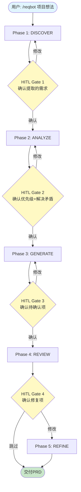

# ReqBot 架构设计文档

## 1. 系统概览

ReqBot 是一个多 Agent 协作的需求分析系统，通过 Claude Code Skill 机制运行。它不是单一 LLM 调用，而是一个有明确阶段划分、Agent 分工、人在回路闸口的工作流引擎。

### 核心设计原则

- **分离关注点**：访谈、分析、撰写、审查由独立 Agent 执行，每个 Agent 有聚焦的职责和可独立测试的输入/输出契约
- **人在回路**：每个阶段切换需用户确认，Agent 不擅自推进关键决策
- **来源可追溯**：PRD 中每条需求可追溯到访谈原文，再前向追溯到 PRD 章节和验收标准
- **不幻觉**：信息不足时标记「待确认」并标注确认角色，不编造数据

---

## 2. Agent 编排模式：Supervisor + Specialists

```
                       ┌─────────────────────┐
                       │    Orchestrator      │
                       │  (SKILL.md)          │
                       │  - Workflow state    │
                       │  - HITL gates        │
                       │  - Agent dispatch    │
                       └──────┬──────────────┘
                              │
          ┌───────────────────┼───────────────────┐
          │                   │                   │
    ┌─────▼──────┐    ┌──────▼──────┐    ┌───────▼──────┐
    │ Interviewer│    │   Analyst   │    │  PRD Writer  │
    │ Phase 1    │    │   Phase 2   │    │   Phase 3    │
    │ 4-round Q  │    │ MoSCoW+Edge │    │ Template fill│
    └────────────┘    └─────────────┘    └──────────────┘
                              │
                      ┌───────▼──────┐
                      │   Reviewer   │
                      │   Phase 4    │
                      │ Audit+Trace  │
                      └──────────────┘
```

### 编排器 vs 专职 Agent 分工

| 职责 | 编排器 (SKILL.md) | 专职 Agent (agents/*.md) |
|------|------------------|-------------------------|
| 工作流推进 | ✅ 状态机 + 阶段切换 | ❌ |
| HITL 闸口 | ✅ 确认提示 + 决策收集 | ❌ |
| 领域逻辑 | ❌ | ✅ 访谈策略/分析/撰写/审查 |
| 文件读写 | ✅ 输出管理 | ❌ 仅通过编排器间接访问 |
| 用户交互 | ✅ 闸口对话 | ✅ 访谈阶段直接交互 |

---

## 3. 工作流详解

### 3.1 完整流程



### 3.2 各阶段输入/输出契约

| 阶段 | 输入 | 输出 | 执行者 |
|------|------|------|--------|
| Discover | 用户项目描述 | `output/discover-{slug}.json` | Interviewer Agent |
| Analyze | Phase 1 JSON | `output/analyze-{slug}.json` | Analyst Agent |
| Generate | Phase 2 JSON + 模板 | `output/prd-{slug}.md` | PRD Writer Agent |
| Review | PRD + Phase 1,2 JSON | `output/review-{slug}.json` | Reviewer Agent |
| Refine | Review + PRD | `output/prd-{slug}-final.md` | Orchestrator 直接执行 |

---

## 4. 记忆系统

ReqBot 采用三层记忆架构：

```
Layer 1: 会话状态 (Conversation Context)
  - 当前阶段位置
  - 待处理的 HITL 决策
  - 存储：Claude Code session transcript

Layer 2: 阶段产物 (Phase Artifacts)
  - output/ 目录下的 JSON/MD 文件
  - 每个阶段的完整输出，可独立审查
  - 实现阶段间数据传递和中断恢复

Layer 3: 知识库 (Knowledge Base)
  - knowledge/prd-template.md    — PRD 结构标准
  - knowledge/edge-case-taxonomy.md — 边界用例枚举框架
  - 可扩展：行业模板、领域Checklist
```

### 中断恢复机制

如果会话中断（Claude Code 退出），可以从 `output/` 目录重建状态：
1. 检查最新的阶段产物文件
2. 手动加载到新会话
3. 从上次完成的阶段继续

---

## 5. 关键设计决策

### 5.1 为什么是多 Agent 而不是单 Agent + 长 Prompt？

| 维度 | 单 Agent | 多 Agent |
|------|---------|---------|
| 指令聚焦 | 单 Prompt 承载所有逻辑，容易冲突 | 每个 Agent 专注一个阶段，指令精确 |
| 可测试性 | 难以定位问题来源 | 可独立审查各阶段输出 |
| 质量保证 | 依赖单次生成质量 | 审查阶段独立检测问题 |
| 人在回路 | 仅最终输出前一次确认 | 每个阶段都有闸口 |
| 面试展示 | "一个长 Prompt" | "Agent 编排系统" — 更体现架构能力 |

### 5.2 为什么不用 Python 脚本做确定性校验？

- Claude 自身推理能力足以完成完整性检查和模糊表述检测
- 减少技术栈复杂度，维护成本更低
- 更直接展示 Agent 推理能力
- 如有确定性规则需求（如字段存在性检查），可直接在 Agent 指令中描述

### 5.3 置信度评分而非静默假设

访谈阶段对每条需求评估置信度（0-100），低于 80 分主动追问。这避免了：
- 静默填充不完整信息
- PRD 中看似完整实则臆测的内容
- 下游决策建立在错误前提上

---

## 6. 扩展点

当前 V1 实现核心闭环。后续可扩展方向：

| 扩展点 | 描述 | 触发条件 |
|--------|------|---------|
| 行业模板 | 电商/金融/医疗等行业专用 PRD 模板 | knowledge/domain-checklists/ |
| 多轮迭代 | 审查后不止一轮修复，直到通过 | 用户反馈驱动 |
| 干系人协作 | 不同角色分别访谈，合并需求 | 多干系人场景 |
| 竞品分析集成 | 在分析阶段纳入竞品调研 | 用户提供竞品信息 |
| 历史需求复用 | 从历史 PRD 中检索相似需求模式 | 积累足够样本后 |
