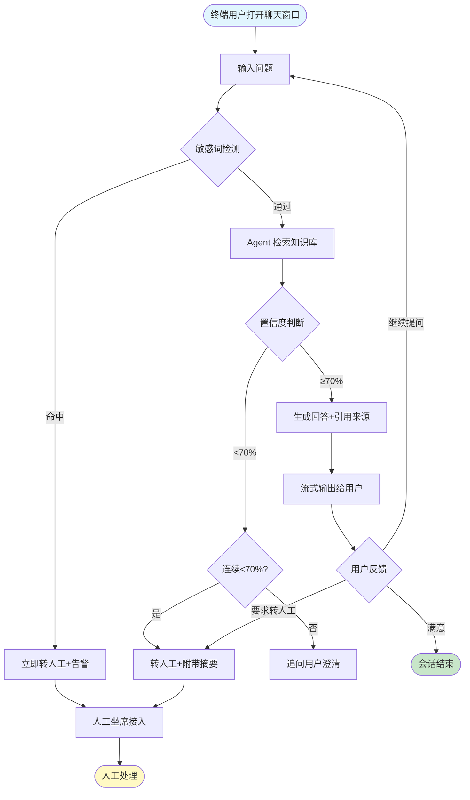

# PRD — AI智能客服Agent平台

---

## 一、文档概述

| 字段 | 内容 |
|------|------|
| 项目名称 | AI智能客服Agent平台 |
| 文档版本 | v1.0 |
| 作者 | 待填写（面试者） |
| 创建日期 | 2026-05-12 |
| 最后更新 | 2026-05-12 |
| 状态 | 草稿 |
| 涉及干系人 | 产品经理（面试者）、客服主管（目标用户画像） |

---

## 二、产品目标与背景

### 2.1 背景

中小企业使用传统客服系统的成本高（人均培训+薪资 5k-8k/月），且高峰期人力不足。现有 AI 客服方案有两类问题：

- **关键词匹配型**：体验差，用户需要精确命中关键词才能获得答案
- **通用大模型型**：直接对客回答不可控，存在幻觉风险，且无法使用企业私有知识

[来源：访谈-产品经理-20240512]

### 2.2 产品目标

- 让 10 人以下客服团队具备 50 人团队的处理能力
- V1：AI 自动处理率（无需人工介入的会话/总会话数）达到 60%
- V2：AI 自动处理率达到 80%

[来源：访谈-产品经理-20240512]

### 2.3 产品愿景（一句话）

让每个中小企业拥有一个可控、可溯源、可私有化部署的 AI 客服 Agent。

---

## 三、目标用户与场景

### 3.1 用户画像

| 画像名称 | 角色描述 | 核心诉求 | 使用频率 | 来源 |
|----------|---------|---------|---------|------|
| 客服主管 | 管理 3-10 人客服团队，维护知识库，监控服务质量。非技术背景 | 降低人工成本，保证回答质量，直观了解 Agent 处理情况 | 每日 | [来源：访谈-产品经理-20240512] |
| 终端用户 | 企业的客户，通过 Web 聊天组件咨询产品/服务问题 | 快速获得准确答案，复杂问题能转人工 | 按需 | [来源：分析推断—基于客服产品通用用户画像] |
| 企业管理员 | 负责初始配置（知识库导入、渠道接入、租户设置），半技术人员 | 快速完成接入配置，一次性为主 | 接入时 + 偶尔 | [来源：分析推断—基于 SaaS 产品通用画像] |

### 3.2 核心使用场景

- 作为终端用户，我想要在网页聊天窗口输入问题，并在 3 秒内获得准确回答，以便快速解决问题（FR-001、FR-009）
- 作为终端用户，当 Agent 无法回答时，我想要无缝转接到人工坐席，且不需要重复描述问题（FR-003）
- 作为客服主管，我想要在管理后台查看 AI 处理率、高频问题，以便持续优化知识库（FR-004）
- 作为企业管理员，我想要上传公司产品文档作为知识库，让 Agent 基于真实信息回答（FR-001、FR-008）

[来源：分析推断—基于访谈提取的 4 个核心需求]

---

## 四、功能需求

### 4.1 功能列表（MoSCoW 优先级）

| ID | 功能名称 | 优先级 | 描述 | 验收标准 | 来源 |
|----|---------|--------|------|---------|------|
| FR-001 | 私有知识库接入 | Must | 企业导入私有知识库（PDF/网页/文本），Agent 基于知识库回答 | 支持 3 种格式；上传后 5 分钟内可检索；回答-原文追溯关联度 ≥95% | [来源：访谈-产品经理—"不能使用公共模型训练数据"] |
| FR-002 | 回答溯源展示 | Must | 回答底部显示引用文档标题，用户可点击展开原文高亮 | 每条回答 ≥1 条引用；无相关内容时说"不知道"而非编造 | [来源：访谈-产品经理—"每条回答要能追溯到知识库里的原文"] |
| FR-003 | 智能转人工 | Must | 用户要求/低置信度/敏感词三类触发转人工，附带会话摘要 | 三类场景全部覆盖；转人工携带 ≤300字摘要 | [来源：访谈-产品经理—"三类触发条件"] |
| FR-004 | Web 管理后台 | Must | 知识库管理、对话记录查看、数据分析仪表盘 | 知识库 CRUD；对话筛选；仪表盘含 AI处理率、高频问题 TOP10 | [来源：访谈-产品经理—"需要有管理后台"] |
| FR-005 | 多租户数据隔离 | Must | 知识库、对话记录、Agent 配置按租户完全隔离 | 跨租户数据不可访问；新增租户无需改代码 | [来源：访谈-产品经理—"多租户必须隔离"] |
| FR-006 | Web 聊天组件 | Must | 提供 JS SDK 供企业嵌入网站 | ≤50KB；一行代码嵌入；移动端/桌面端自适应 | [来源：访谈-产品经理—"Web端嵌个聊天组件"] |
| FR-007 | REST API | Must | 对话接口供企业自有系统集成 | /conversations CRUD；API Key 认证；P99 <5s | [来源：访谈-产品经理—"也要有API"] |
| FR-008 | 知识库内容管理 | Should | 客服主管可增删改查条目、批量导入 | 单条创建；CSV/Excel 批量导入 ≤5000条；更新后 5 分钟生效 | [来源：访谈-产品经理—"运营/客服主管维护知识库"] |
| FR-009 | 流式低延迟回复 | Must | 首 token <3s，流式输出 | P95 <3s；P99 <5s；≥30 tokens/s | [来源：访谈-产品经理—"3秒内开始回复"] |
| FR-010 | 敏感词检测 | Should | 企业配置自定义敏感词库，命中转人工+告警 | 支持自定义词库；命中实时告警；检测延迟 <200ms | [来源：访谈-产品经理—"敏感词检测"] |
| FR-011 | 工单导出 | Could | 转人工会话导出为 CSV/JSON | 含会话ID、时间、消息、转人工原因 | [来源：访谈-产品经理—"预留工单导出接口"] |
| FR-012 | 回答质量评估 | Could | 客服主管对回答进行满意度标注 | 支持满意/不满意/需改进标注；仪表盘汇总 | [来源：分析推断—基于 gaps_identified 评估需求] |

### 4.2 FR-001 功能详解：私有知识库接入

- **前置条件**：企业管理员完成租户注册，进入管理后台
- **主流程**：
  1. 管理员选择「知识库管理」→「导入」
  2. 选择导入方式：上传文件（PDF/文本）或输入 URL
  3. 系统校验文件格式和大小（PDF ≤20MB）
  4. 后台异步解析文档 → 文本分块 → 向量化 → 存入租户专属向量库
  5. 管理后台显示处理进度，完成后通知
  6. 管理员可在知识库列表中查看、搜索、测试检索效果
- **异常流程**：文件解析失败 → 标记为「处理失败」，展示错误原因，支持重新上传
- **来源**：[来源：访谈-产品经理-20240512 + AMB-001 决议]

---

## 五、范围定义

### 5.1 V1 范围

- 私有知识库接入（PDF/网页/文本）
- 基于 RAG 的 Agent 对话 + 回答溯源
- 三类规则智能转人工 + 会话摘要
- Web 管理后台（知识库管理 + 对话监控 + 数据仪表盘）
- 多租户隔离架构
- Web 聊天组件 + REST API 两个渠道
- 仅支持中文、仅被动应答

### 5.2 明确不做（Out of Scope）

- 企微/飞书/钉钉等 IM 渠道接入（V2）
- 主动营销/促单对话
- CRM/工单系统集成
- 多语言支持
- Agent 语气风格自定义
- 大型呼叫中心场景（100+ 坐席）

### 5.3 后续版本规划

- V2：多渠道接入、英文支持、CRM 集成、Agent 人格定制
- V3：主动营销、多 Agent 协作、语音接入

[来源：访谈-产品经理-20240512 Round 3]

---

## 六、用户流程



**每步标注**：
- 用户动作：输入问题 → 查看回答 → 点击来源 → 要求转人工
- 系统响应：敏感词检测 → 知识检索 → 置信度评估 → 流式回复 → 转人工决策
- 异常分支：敏感词命中 → 直接转人工；连续低置信度 → 转人工

[来源：分析推断—基于 FR-001/FR-002/FR-003/FR-009 组合]

---

## 七、非功能需求

| ID | 类别 | 要求 | 度量方式 | 来源 |
|----|------|------|---------|------|
| NFR-001 | 性能 | 首 token 延迟 P95 <3s | 生产环境连续 7 天 P95 数据 | [来源：访谈-产品经理—"3秒内开始回复"] |
| NFR-002 | 性能 | 流式输出 ≥30 tokens/s | 生产环境监控 | [来源：分析推断—行业标准] |
| NFR-003 | 安全 | 多租户完全隔离，跨租户数据访问返回 403 | 自动化测试 + 安全审计 | [来源：访谈-产品经理—"多租户必须隔离"] |
| NFR-004 | 安全 | API 调用需 API Key 认证，无认证返回 401 | 自动化测试 | [来源：分析推断—API 安全标准实践] |
| NFR-005 | 可用性 | 系统可用性 ≥99.5%（不含计划维护） | 月度监控 | [来源：分析推断—B2B SaaS 行业标准] |
| NFR-006 | 可扩展性 | 支持单租户 50000 条知识库条目 | 压力测试 | [来源：分析推断—中小型企业知识库规模上限] |
| NFR-007 | 隐私 | 租户数据不出其所属 Region，不用于模型训练 | 架构评审确认 | [来源：访谈-产品经理—"不能使用公共模型训练数据"] |

---

## 八、数据需求

### 8.1 数据实体

- **Tenant**：租户 ID、名称、创建时间、配置（敏感词列表、欢迎语）
- **KnowledgeEntry**：条目 ID、租户 ID、标题、内容、分类、标签、状态、创建/更新时间
- **Conversation**：会话 ID、租户 ID、用户标识、状态（进行中/已转人工/已结束）、渠道来源
- **Message**：消息 ID、会话 ID、角色（user/agent/human）、内容、来源引用、置信度、时间戳
- **HandoverRecord**：转接 ID、会话 ID、触发原因、会话摘要、坐席 ID、处理状态

### 8.2 数据流

```
用户消息 → 敏感词预检 → RAG检索(向量库) → LLM生成 + 引用注入 → 流式输出
                              │
                         知识库文档 ← 管理员上传
                              │
                         对话记录 → 管理后台仪表盘
                              │
                         转人工记录 → 坐席界面 → 工单导出
```

### 8.3 隐私与合规

- 每个租户的知识库和对话数据存储于独立命名空间，物理隔离待确认（需技术评估）
- LLM 调用使用无训练数据回传的 API 方案（如 OpenAI API 的 model training opt-out）
- V1 不处理个人敏感信息（PII）— 若业务侧聊天中涉及，需脱敏处理。具体脱敏规则 → 待法务确认

[来源：分析推断—基于 NFR-007 + 行业实践]

---

## 九、业务规则与边界用例

### 9.1 核心业务规则

- BR-001：Agent 不得编造知识库中不存在的信息，无匹配内容时回复「抱歉，我目前的知识库中没有相关信息」
- BR-002：转人工时携带的会话摘要 ≤300 字，包含用户核心问题和 Agent 已尝试的回答
- BR-003：同一租户的并发会话数不限制，但单用户并发消息按到达顺序处理
- BR-004：知识库更新后，新会话立即生效，已有会话在下一轮对话中生效

### 9.2 边界用例

#### 边界值
- [EC-001] 上传 0 字节 PDF → 后端校验拒绝 [优先级: P2] [来源：分析推断]
- [EC-002] 单租户知识库达到 50000 条上限 → 提示已达上限 [优先级: P1] [来源：分析推断]

#### 并发
- [EC-003] 多人同时编辑同一知识库条目 → 乐观锁冲突提示 [优先级: P1] [来源：分析推断]
- [EC-004] 用户弱网恢复后积压消息批量到达 → 队列处理，>5 条提示稍候 [优先级: P1] [来源：分析推断]

#### 状态转换
- [EC-005] 转人工等待中用户继续向 Agent 发消息 → 推送坐席，Agent 静默 [优先级: P1] [来源：分析推断]
- [EC-006] 转人工但无在线坐席 → 提示等待+留言入口 [优先级: P0] [来源：分析推断]

#### 输入校验
- [EC-007] 用户输入 SQL/XSS 注入脚本 → 清洗后视为普通文本安全展示 [优先级: P0] [来源：分析推断]
- [EC-008] 知识库中存在矛盾信息 → 优先使用最新条目，后台提示矛盾 [优先级: P1] [来源：分析推断]

#### 异常恢复
- [EC-009] LLM 服务超时 → 自动重试 1 次，仍失败提示转人工 [优先级: P0] [来源：分析推断]
- [EC-010] 知识库热更新期间对话不中断 → 已有会话下轮生效新知识库 [优先级: P2] [来源：分析推断]

---

## 十、依赖与风险

### 10.1 外部依赖

| 依赖项 | 用途 | 状态 |
|--------|------|------|
| LLM API（如 Claude API） | Agent 对话生成 | 已有（通过 Claude Code） |
| 向量数据库（如 Pinecone/Milvus） | 知识库存储与检索 | 待选型 |
| Embedding 模型 | 文档向量化 | 待选型 |
| 云服务商（存储/计算） | 生产环境部署 | 待确认 |

### 10.2 风险与缓解

| 风险 | 影响 | 概率 | 缓解措施 | 负责人 |
|------|------|------|---------|--------|
| LLM 幻觉导致 Agent 编造不实信息 | 高—客户信任崩塌 | 中 | RAG 强约束 + 无匹配时拒答 + 溯源展示 + 人工抽检 | PM |
| 知识库检索质量不达标影响回答准确性 | 高—产品核心价值受损 | 中 | 选型阶段对比多个 Embedding 模型；支持客服主管手动调整检索结果 | PM + 工程 |
| 多租户架构复杂度导致 V1 延期 | 中—开发周期 | 中 | 使用成熟的 SaaS 框架/平台；V1 不做物理隔离，逻辑隔离先行 | 工程 |
| LLM API 成本不可控 | 中—毛利率 | 中 | 缓存常见问题；设置租户级 Token 用量上限；监控成本/会话 | PM |
| 中小企业知识库质量普遍偏低 | 中—Agent 效果差 | 高 | 提供知识库模板和示例；管理后台给出优化建议 | PM |

---

## 十一、成功指标

| 指标 | 定义 | 基线 | 目标 | 测量方式 | 来源 |
|------|------|------|------|---------|------|
| AI 自动处理率 | 无需人工介入的会话 / 总会话数 | 0（新产品） | V1 ≥60% | 管理后台仪表盘 | [来源：访谈-产品经理-20240512] |
| 回答准确率 | 人工抽检中回答"正确"+"基本正确"占比 | 0 | ≥85% | 每周抽检 100 条 | [来源：分析推断—基于客服行业标准] |
| 首 token 延迟 P95 | 用户发消息到首字出现的时间 | — | <3s | 生产环境监控 | [来源：FR-009] |
| 租户接入时间 | 从注册到 Agent 可回答知识库问题的时间 | — | <30 分钟 | 用户行为日志 | [来源：分析推断—推断自 FR-001 导入流程设计] |
| 用户满意度 | 对话结束后用户 👍 占比 | — | ≥80% | 聊天组件满意度按钮 | [来源：分析推断—对标行业客服满意度标准] |

---

## 十二、排期与里程碑

| 里程碑 | 交付物 | 预计日期 | 负责人 | 状态 |
|--------|--------|---------|--------|------|
| M1: 技术选型完成 | 向量数据库 + Embedding 模型选型报告 | 待确认 | 工程 | 待开始 |
| M2: 核心 RAG 管道 | 文档解析 → 向量化 → 检索 → 生成 跑通 | 待确认 | 工程 | 待开始 |
| M3: 管理后台 MVP | 知识库管理 + 对话记录 + 数据仪表盘 | 待确认 | 工程 + 设计 | 待开始 |
| M4: Web 聊天组件 | JS SDK + 流式对话 + 溯源展示 | 待确认 | 工程 + 设计 | 待开始 |
| M5: 多租户 + 转人工 | 租户隔离 + 三类转人工规则 | 待确认 | 工程 | 待开始 |
| M6: 内测版本 | 邀请 3-5 家企业试用 | 待确认 | PM | 待开始 |
| M7: V1 发布 | 正式上线 | 待确认 | PM | 待开始 |

---

## PRD 元数据

```json
{
  "phase": "generate",
  "project_name": "AI智能客服Agent平台",
  "template_used": "standard",
  "sections_completed": {
    "一、文档概述": "complete",
    "二、产品目标与背景": "complete",
    "三、目标用户与场景": "complete",
    "四、功能需求": "complete",
    "五、范围定义": "complete",
    "六、用户流程": "complete",
    "七、非功能需求": "complete",
    "八、数据需求": "partial — 隐私合规中 PII 脱敏规则标为待确认",
    "九、业务规则与边界用例": "complete",
    "十、依赖与风险": "partial — 向量数据库和云服务商待选型",
    "十一、成功指标": "complete",
    "十二、排期与里程碑": "partial — 所有日期待确认"
  },
  "pending_items": [
    {
      "section": "八、数据需求",
      "field": "PII 脱敏规则",
      "missing_info": "聊天内容中涉及个人敏感信息的具体脱敏策略",
      "who_to_ask": "需法务确认",
      "impact": "影响数据存储方案和合规声明"
    },
    {
      "section": "十、依赖与风险",
      "field": "向量数据库和云服务商选择",
      "missing_info": "具体技术选型",
      "who_to_ask": "需工程团队评估",
      "impact": "影响架构设计和成本估算"
    },
    {
      "section": "十二、排期与里程碑",
      "field": "所有日期",
      "missing_info": "缺少工程资源估算",
      "who_to_ask": "需工程团队评估",
      "impact": "无法给出可承诺的排期"
    },
    {
      "section": "三、目标用户",
      "field": "企业管理员画像详情",
      "missing_info": "基于分析推断而非真实用户访谈",
      "who_to_ask": "需真实客户验证",
      "impact": "画像可能偏离实际，影响后台设计"
    }
  ],
  "requirement_coverage": {
    "total_requirements": 12,
    "covered_in_prd": 12,
    "uncovered": []
  },
  "ready_for_review": true
}
```
